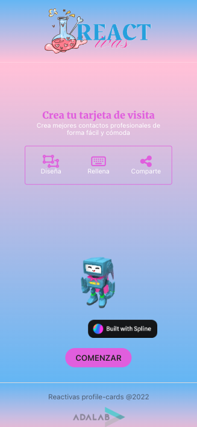
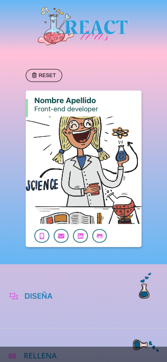
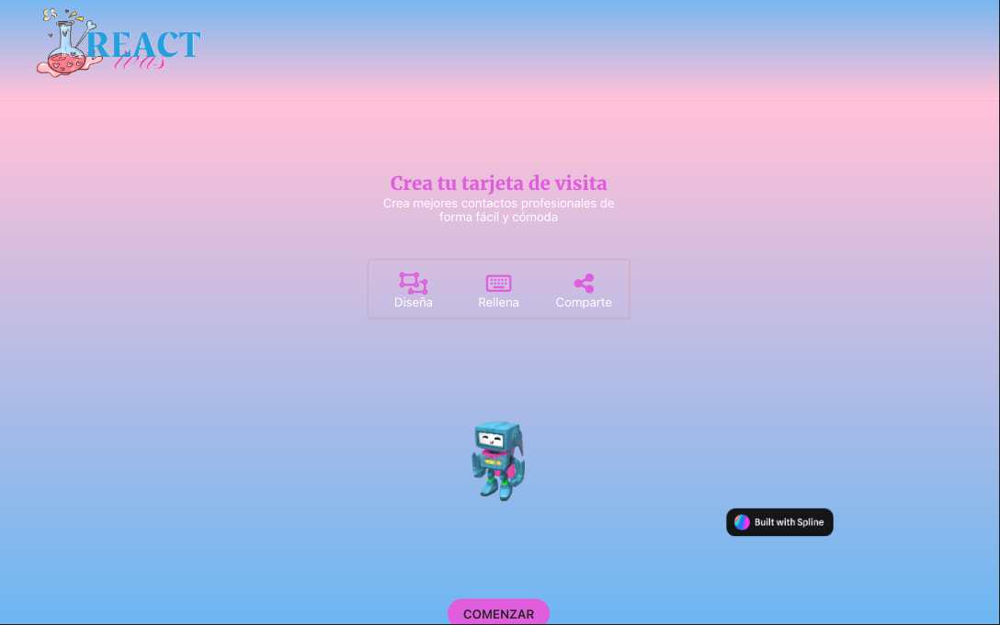
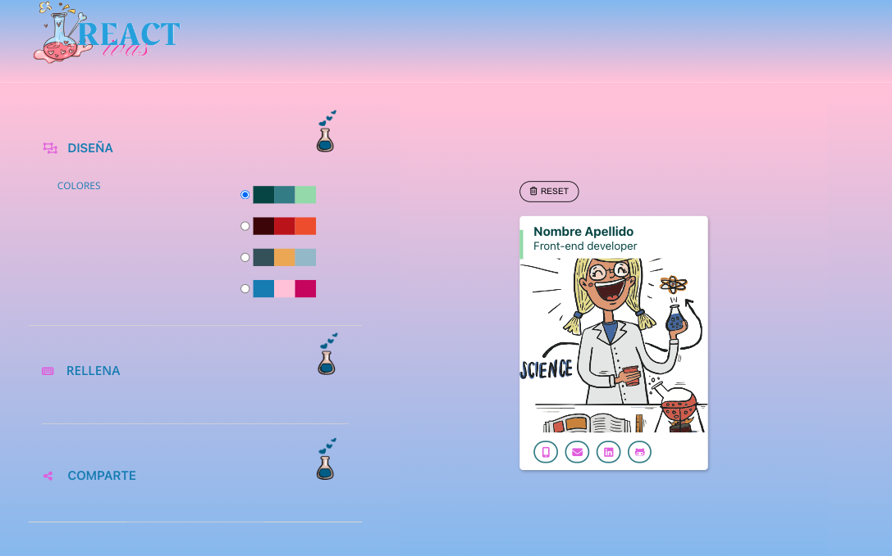

<h1 align="center">REACTivas Profile Cards</h1>

---

<div align="center">
   Solution for proyect of module 3 and 4 by team 5 at <a href="https://adalab.es/">
     Adalab
    </a>.
</div>

<div align="center">
  <h3>
    <a href="https://reactivas.herokuapp.com/">
      Demo
    </a>
    <span> | </span>
    <a href="https://github.com/olgargarrucho/REACTivas-Profile-Cards">
      Solution
    </a>
  </h3>
</div>

---

## Table of Contents

- [General Info](#general-info)
- [Technologies](#technologies)
- [Installation](#installation)
- [Result](#result)
- [Contact](#contact)
- [License](#license)

---

## General Info

Solution for proyect of module 3 and 4 by team 5 made up by [M.Luisa Lufrano](https://github.com/MLLuisa), [Laura Martín](https://github.com/lauramargo), [Marianela Landoni](https://github.com/MarianelaLandoni) and me, [Olga R. Garrucho](https://github.com/olgargarrucho).

Develop a web application to generate profile cards and a server to manage the cards have been generated.

The code has been inherited of other team. We use React, Express, SQL and EJS.

First, we made the web with the inherited code of HTML and SASS and we used React to users interfaces. The web should have the same interactivity as the inherited team.

Then, we made the server with EXPRESS and CORS; and the database with SQL.

The web has a landing page with a 3D frame and a button to continue to home page. At the home page, there are three collapsables: design, to choose a palette of colors; fill, to complete the form with all the data; and share, to generate the card and share it by twitter; and a preview section to see the changes at card. Only can be open one collapsable at once.

When the user enters some data, the object of state hooks changes. If the object isn't completed, it appears a message to complete the field isn't completed. 

Then, when the object is completed, the server generated a card's link that the user can be share by twitter or by another social network. The object with the data's card is saved at server.


### Web responsive mobile:

 

### Web responsive desktop:

 

### Demo:


---

## Technologies

- [Visual Studio Node](https://code.visualstudio.com/download) Version: May 2022
- [Git](https://git-scm.com/download/mac) Version: 2.36.1
- [Node JS](https://nodejs.org/es/download/) Version: v14.19.3
- [React](https://es.reactjs.org/)
- [Git Hub](https://github.com/)

---

## Installation

For open the exercise it´s necesary to do the next steps:

```
$ git clone https://github.com/olgargarrucho/REACTivas-Profile-Cards
$ cd ../path/to/the/file
$npm install
$npm start
```

---

## Result

To view the final´s result of exercise click [here](https://reactivas.herokuapp.com/).

---

## Contact

- [Linkedin](https://www.linkedin.com/in/olgargarrucho)
- [GitHub](https://github.com/olgargarrucho)
- [Twitter](https://twitter.com/olgargarrucho)

---

## License

Copyright (c) 2022, Olga RG.
